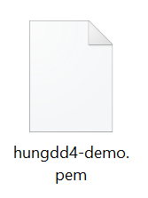
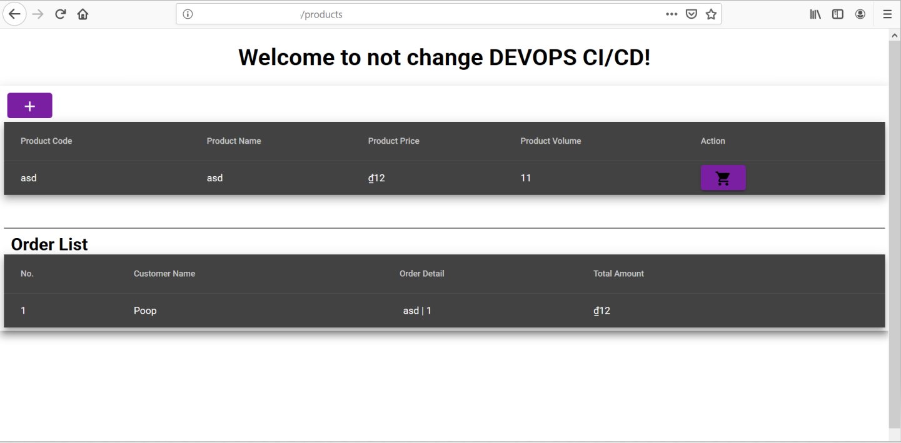
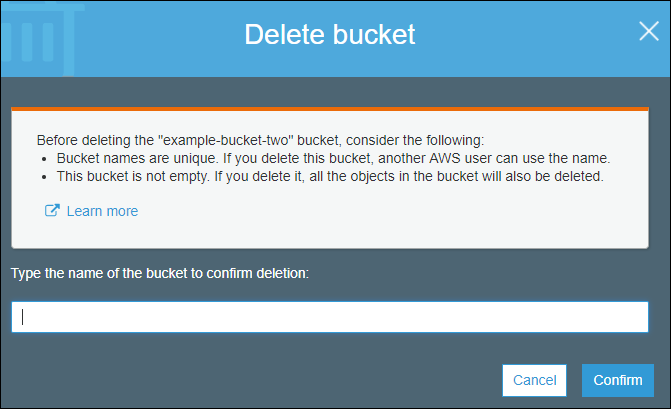

# Blue/Green Deployment with AWS Demonstration

Build a demonstration e-commerce application with Docker image for Microservices using Blue/Green Deployment stategy on AWS

## Contents

- [Blue/Green Deployment with AWS](#blue-green-deployment-with-aws-demonstration)
  - [Contents](#contents)
  - [1. Introduction](#introduction)
    - [Purpose](#purpose)
    - [Audience](#audience)
    - [System Infrastructure Design](#system-infrastructure-design)
    - [CI/CD DevOps AWS Design](#cicd-devops-aws-design)
  - [2. Demonstration Preparation](#demonstration-preparation)
    - [Policies Check-list for IAM user](#policies-checklist-for-iam-user)
    - [Create Access key](#create-access-key)
    - [Setup AWS CLI default configure](#setup-aws-cli-default-configure)
    - [Setup Git profile](#setup-git-profile)
    - [Create Key Pair](#create-key-pair)
  - [3. Deployment Step](#deployment-step)
    - [Modify config.sh file](#modify-config-file)
    - [Setting up the whole system infrastructure](#setting-up-the-whole-system-infratructure)
    - [Create Database schema for microservices](#create-database-schema-for-microservices)
  - [4. Smoke testing](#smoke-testing)
    - [The application](#the-application)
    - [The CICD pipeline](#the-cicd-pipeline)
  - [5. Clearance](#clearance)
    - [Delete CloudFormation Build stack](#delete-cloudformation-build-stack)
    - [Delete CloudFormation Blue/Green stack](#delete-cloudformation-blue-green-stack)
    - [Delete CloudFormation pipeline stack](#delete-cloudformation-pipeline-stack)
## 1. Introduction
### Purpose
This document describes the system resources and processes from the deployment perspective and provides comprehensive guidelines on operating and maintaining the system. The main topics covered in this document include:
  - Deployment preparations and checklists
  - Detailed guidelines for deployment

### Audience
This document mainly targets the operation team and whomever concerned with the operating perspectives of the system.

### System Infrastructure Design

### CI/CD DevOps AWS Design

## 2. Demonstration Preparation
### Policies Check-list for IAM user
The IAM user for jenkins must has the following policies attached both directly or indirectly by group for deploying successfully.

Except for the policy **custom-cloud-demo-deploy-policy**, all other policies attached are AWS managed policies which are available to use.
The **custom-cloud-demo-deploy-policy** allows user to have full access of **application-autoscaling** and **apigateway** services.
This custom policy can be created by using the following JSON code:
{
    "Version": "2012-10-17",
    "Statement": [
        {
            "Sid": "VisualEditor0",
            "Effect": "Allow",
            "Action": [
                "application-autoscaling:*",
                "apigateway:*"
            ],
            "Resource": "*"
        }
    ]
}

### Create access key
The access key is used for sonar scanning in later stage.

- **Step 1**: Use your AWS account ID or account alias, your IAM user name, and your password to sign in to the IAM console.

- **Step 2**: In the navigation bar on the upper right, choose your user name, and then choose My Security Credentials.

- **Step 3**: On the AWS IAM Credentials tab, choose Create access key. Then choose Download .csv file to save the access key ID and secret access key to a .csv file on your computer. Store the file in a secure location. You will not have access to the secret access key again after this dialog box closes. After you have downloaded the .csv file, choose Close. When you create an access key, the key pair is active by default, and you can use the pair right away.

### Setup AWS CLI default configure

**Prerequisites:** The access key from section [Create Access key](#create-access-key)
- **Step 1**: Run command “aws configure”
- **Step 2**: Insert the value for the following default attributes of aws configure:

- **Note(s)**:
  - AWS Access Key ID: key id get from .csv file from section [Create Access key](#create-access-key)
  - AWS Secret Access Key: key get from .csv file from section [Create Access key](#create-access-key)
  - Default region name: The Default region name identifies the AWS Region whose servers you want to send your requests to by default. This is typically the Region closest to you, but it can be any Region.
  - Default output format: The Default output format specifies how the results are formatted. The value can be any of the values in the following list. If you don't specify an output format, json is used as the default.
    - json: The output is formatted as a JSON string.
    - text: The output is formatted as multiple lines of tab-separated string values, which can be useful if you want to pass the output to a text processor, like grep, sed, or awk.
    - table: The output is formatted as a table using the characters +|- to form the cell borders. It typically presents the information in a "human-friendly" format that is much easier to read than the others, but not as programmatically useful.

### Setup Git profile
Run the following command:
 - git config --global user.name "MY_NAME"
 - git config --global user.email “MY_NAME@example.com”
Note(s):
 - MY_NAME: your name
 - MY_NAME@example.com: your email address

### Create Key Pair
Key Pair is used to ssh to the ec2 bastion and to create the ssh tunnel to manage backend DB.
- **Step 1:** Open the Amazon EC2 console at https://console.aws.amazon.com/ec2/.
- **Step 2:** In the navigation pane, under NETWORK & SECURITY, choose Key Pairs.
- **Step 3:** Choose Create Key Pair  

- **Step 4:** Enter a name for the new key pair in the Key pair name field of the Create Key Pair dialog box, and then choose Create.

**Note**
Take note this key pair name as it will be used as a parameter in the Cloud Formation **cloud-demo-bluegreen.json** template file.

## 3. Deployment Step
### Modify config.sh file
Modify the config.sh file in the script folder by changing the value for the parameters in the file.
 - GITUSERNAME: the AWS GIT Credential username
 - GITPASSWORD: the AWS GIT Credential userpassword
 - PRODUCTSERVICEREPONAME: CodeCommit Repository name of product service
 - ORDERSERVICEREPONAME: CodeCommit Repository name of order service
 - FRONTENDSERVICEREPONAME: CodeCommit Repository name of frontend service
 - GITBRANCH: the branch of the repository that represents store source code of specific environment
 - DBUsername: RDS DB username
 - DBPassword: RDS DB password
 - SCRIPTDIR: the directory that story all the scripts setting up the whole CICD.
 - CFBUILDSTACKNAME: CloudFormation Stack name for Build infrastructure
 - CFINFRASTACKNAME: CloudFormation Stack name for Deployment infrastructure
 - CFPIPELINESTACKNAME: CloudFormation Stack name for CI/CD pipeline
 - AWSREGION: the AWS region running this scripts 
 - KEYPAIRNAME: the EC2 key pair

### Setting up the whole system infrastructure
The infrastructure will be created by the CloudFormation stack are VPC, Subnets, ALB, NLB, RDS Instance, EC2 Bastion, API Gateway.
Please ref to: **cloud-demo-bluegreen.json**
**Important Note**: If you are deploying this demonstration in region **us-east-1**, please modify the value of **DomainName** property of **demoDHCPOption** in cloud-demo-bluegreen-infras.json to “ec2.internal”.
For other regions, ignore this note and leave it as default.

- **Step 1**: Open bash, and go to the directory that store all the script files.
- **Step 2**: Run the "demo.sh" script file, and wait until the installation is finished.

### Create Database schema for microservices
Since the MySQL RDS Instance was created by the CloudFormation stack with the default schema “product_db” (used for Product service), the only DB schema left that needed to create is “order_db”.
- Windows
  - Connect to the RDS Instance by using the ssh tunnel through the Bastion.
    - On the local machine, run the following script to create the ssh tunnel through the Bastion: ssh -v -i <KEYPAIR_FILE> -N -L 3307:<RDS_ENDPOINT>:<RDS_PORT> ec2-user@<BASTION_PUBLICIP>
      - <KEYPAIR_FILE>: the key pair file created from [Create Key Pair](#create-key-pair) of this documentation (pem file). E.g: 
    
      - <RDS_ENDPOINT>: the Endpoint of RDS Instance that can be taken from CloudFormation stack Outputs or AWS RDS Console. E.g: CloudFormation outputs: 
    
      - <RDS_PORT>: the port of the DB that can be taken from AWS RDS Console
    
      - <BASTION_PUBLICIP>: the public IP of Bastion (On AWS Console, go to EC2 -> Instances) that allows SSH from outside. E.g: 
    
    - After executing the script, the result will be like this:
    
  - Create “order_sb” schema.
    - After successfully creating the SSH tunnel to the Database, connect to the MySQL database by using the following information:  
      <HOST_NAME>: 127.0.0.1 
      <RDS_PORT>: 3307 (defined in the previous script) 
      <DB_USERNAME>: the DatabaseUser value input in the CloudFormation parameter 
      <DB_PASSWORD>: the DatabasePassword value input in the CloudFormation parameter 
    - After connecting to the DB successfully, execute the script “create database order_db” to create the “order_db” schema.
    
    - Finally, ensure the database has the 2 required schemas which are “product_db” and “order_db” like the image above.
- CentOS
  - **Step 1**: Run command: ssh -o StrictHostKeyChecking=no -i <KEYPAIR_FILE> -t ec2-user@<BASTION_PUBLICIP> "sudo yum install mysql -y"
  - **Step 2**: Run command: ssh -o StrictHostKeyChecking=no -i <KEYPAIR_FILE> -t ec2-user@<BASTION_PUBLICIP> "mysql --host=<RDS_ENDPOINT> --protocol=tcp --port=3306 -u<DB_USERNAME> -p<DB_PASSWORD> -e 'CREATE DATABASE IF NOT EXISTS order_db'"

## 4. Smoke testing
### The application
Accessing to the application website with address http://<PUBLIC_DOMAIN>/products, <PUBLIC_DOMAIN> is the value of the public domain name that used for mapping with the ALB DNS. E.g. http://<PUBLIC_DOMAIN>/products. The application is successfully deployed when it can function as expected like calling the API successfully for retrieving data from database and displaying it or adding new data to the database.

 - **Product service:**
   - **Step 1**: go to the site http://<PUBLIC_DOMAIN>/product-add, and add new record of the product then click on the button with icon save.
   
   - **Step 2**: the site will be redirected to http://<PUBLIC_DOMAIN>/products, and new record added successfully will be displayed.
   
 - **Order service:**
   - **Step 1:** Click on the button with icon basket on the product data row.
   
   - **Step 2:** Input the number of item for the order, the number should be less than the product volume number.
   - **Step 3:** Click on Buy button, then the order record will be displayed if order successfully.
   
### The CICD pipeline
Ensuring 3 CICD pipeline for the 3 microservices were created successfully and all of them has “Succeeded” status in each execution.

## 5.	Clearance
Please follow the deletion guide step by step in order to clear this whole demo successfully
### Delete CloudFormation Build stack
- **Step 1:** Delete all 4 ECR repositories of product, order, frontend services and the sonar scanner ecr repo.
  - Open the Amazon ECR console at https://console.aws.amazon.com/ecr/repositories.
  - From the navigation bar, choose the region that contains the repository to delete.
  - In the navigation pane, choose Repositories
  - On the Repositories page, select the repository to delete and choose Delete.
  - In the Delete repository_name window, verify that the selected repositories should be deleted and choose Delete.
- **Step 2:** Delete build-project stack
  - On the Stacks page in the CloudFormation console, select the “build” stack that you want to delete. The stack must be currently running.
  - In the stack details pane, choose Delete.
  - Select Delete stack when prompted.  
    **Note**: After stack deletion has begun, you cannot abort it. The stack proceeds to the DELETE_IN_PROGRESS state.
  - After the stack deletion is complete, the stack will be in the DELETE_COMPLETE state. Stacks in the DELETE_COMPLETE state are not displayed in the AWS CloudFormation console by default.

### Delete CloudFormation Build stack
- **Step 1:** Stop all ECS Tasks and Delete ECS services of cluster cloud-dev-demo-cluster
  - Open the Amazon ECS console at https://console.aws.amazon.com/ecs/.
  - On the navigation bar, select the Region that your cluster is in.
  - In the navigation pane, choose Clusters and select the name of the cluster in which your service resides.
  - On the Cluster : name page, choose Tasks.
  - Choose Stop All
  - When confirmation prompted, confirm the Stop action by type in “STOP ALL” and choose Stop all.
  - Then on the Cluster : name page, choose Services.
  - Check the box to the left of the service to delete and choose Delete.
  - Confirm the service deletion by entering the text phrase and choose Delete.
- **Step 2:** Delete all Deployment Application of the 3 services product, order, frontend.
  - Sign in to the AWS Management Console and open the CodeDeploy console at https://console.aws.amazon.com/codedeploy.  
    **Note**: Sign in with the same account or IAM user information that you used in Getting Started with CodeDeploy.
  - In the navigation pane, expand Deploy, and then choose Applications.
  - In the list of applications, choose the button next to the application you want to delete, and then choose Delete.
  - When prompted, enter the name of the application to confirm you want to delete it, and then choose Delete.
- **Step 3:** Delete Custom Domain Name in API Gateway
  - Run the script with aws cli: “aws apigateway delete-domain-name --domain-name 'api.demo.akaword.io' --region AWS-region” <bt/>
    **Note**: AWS-region – the AWS region setting up this demo.
- **Step 4:** Delete API Gateway method and stage: ANY method in productservice and orderservice resource and the ‘demo’ stage
  - Sign in to the API Gateway console at https://console.aws.amazon.com/apigateway.
  - In the box that contains the name of the API for the method, choose Resources.
  - In the Resources pane, choose the arrow next to the resource for the method.
  - Choose the method, and then choose Delete Method.
  - When prompted, choose Delete.
  - In the box that contains the name of the API for the stage, choose Stages. 
  - In the Stages pane, choose the stage you want to delete, and then choose Delete Stage. 
  - When prompted, choose Delete. 
- **Step 5:** Delete VPC Link named cloud-dev-demo-vpclink
  - Sign in to the API Gateway console at https://console.aws.amazon.com/apigateway.
  - In the navigation pane, choose VPC Links.
  - Click on the ‘x’ icon on the top right corner of the VPC Link that need to delete.
  - When confirmation box prompted, click on Delete vpclink-id button.
- **Step 6:** Delete CloudFormation blue/green stack which clear the remaining resources
  - On the Stacks page in the CloudFormation console, select the “bluegreen” infrastructure stack that you want to delete. The stack must be currently running.
  - In the stack details pane, choose Delete.
  - Select Delete stack when prompted.
     **Note**: After stack deletion has begun, you cannot abort it. The stack proceeds to the DELETE_IN_PROGRESS state.
  - After the stack deletion is complete, the stack will be in the DELETE_COMPLETE state. Stacks in the DELETE_COMPLETE state are not displayed in the AWS CloudFormation console by default.
     **Note**: Deletion failure
    - Case 1: If the deletion got error related with deleting target group failed, check whether ecs tasks were all stopped and all ecs services were deleted, then delete the stack again.
    
    - Case 2: If the deletion got error related with vpclink delete failed, redo from the step 3 to step 5 and ensure these steps has done successfully.
- **Step 7:** Delete Managed Certificates of the domains used for the api and the application of this demo
  - In the list of certificates, select the check box for the ACM Certificate that you want to delete. For Actions, choose Delete. 
  **Note**: You cannot delete an ACM Certificate that is being used by another AWS service. To delete a certificate that is in use, you must first remove the certificate association.

### Delete CloudFormation pipeline stack
- **Step 1:** Delete S3 bucket of pipeline
  - Sign in to the AWS Management Console and open the Amazon S3 console at https://console.aws.amazon.com/s3/.
  - In the Bucket name list, choose the bucket icon next to the name of the bucket “codepipline-awsregion-cloud-dev-demo” and then choose Delete bucket.  
  
  - In the Delete bucket dialog box, type the name of the bucket that you want to delete for confirmation, and then choose Confirm.  
    **Note:** The text in the dialog box changes depending on whether the bucket is empty, is used for a static website, or is used for ELB access logs.
  
- **Step 2:** Delete CloudFormation pipeline stack
  - On the Stacks page in the CloudFormation console, select the pipeline stack that you want to delete. The stack must be currently running.
  - In the stack details pane, choose Delete.
  - Select Delete stack when prompted.  
    **Note:** After stack deletion has begun, you cannot abort it. The stack proceeds to the DELETE_IN_PROGRESS state.
  - After the stack deletion is complete, the stack will be in the DELETE_COMPLETE state. Stacks in the DELETE_COMPLETE state are not displayed in the AWS CloudFormation console by default.

